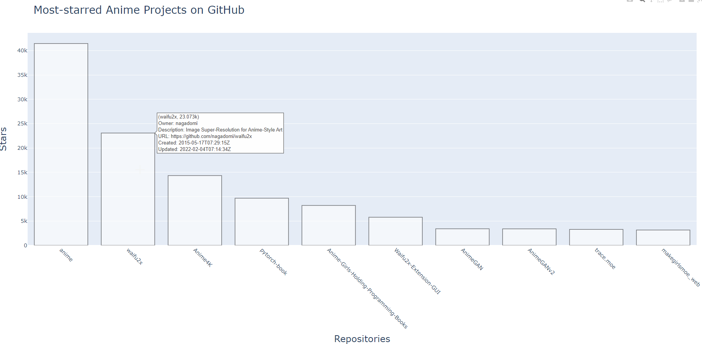

# Visualization GitHub top-rated repositories by keyword


Python script generates html-page with information about top-rated GitHub repositories by provided keyword.

Installation:
`pip install requests, plotly`

Help:
```
usage: TopRepoVisualizer.py [-h] -k KEYWORD [-s] [-l LIMIT] [-o OUTPUT]

This script creating barchart with the most popular Git repositories found by
keyword

optional arguments:
  -h, --help            show this help message and exit
  -k KEYWORD, --keyword KEYWORD
                        Keyword that you would like to search
  -s, --show            show list with repositories info
  -l LIMIT, --limit LIMIT
                        Searching result limit (default: 30)
  -o OUTPUT, --output OUTPUT
                        output list with repo and urls into provided file
```

Usage example:
`python TopRepoVisualizer.py --keyword anime --limit 10`

Result:

